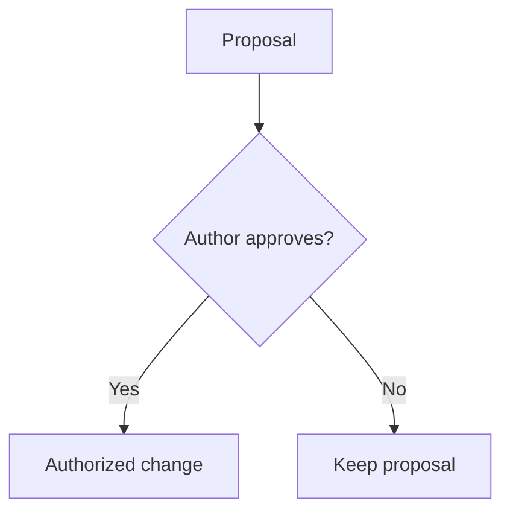

# Inline Mermaid diagrams

Notes renders Mermaid flowcharts and state diagrams into inline SVG during Markdown compilation.
The diagrams need no browser JavaScript. Their source stays in the Markdown file.
The renderer is `beautiful-mermaid` 1.1.3. It supports a subset of Mermaid syntax.
Other Mermaid diagram types are not enabled in Notes.

Use a fenced `mermaid` block. Add a single-line `accTitle` and `accDescr` after the diagram header.
The title becomes the visible caption and SVG accessible name.
The description explains the relationships for readers who cannot see the diagram.

Keep diagrams small. Prefer short, quoted node labels and basic arrows.
Explain complex conditions in the surrounding prose.
Review each rendered diagram against the source procedure; rendering does not establish technical correctness.

The build adds unique SVG IDs and escapes accessible metadata.
Diagrams use the site's local font and light/dark color variables.
Wide diagrams scroll within a focusable region, keeping labels readable on small screens.
Print styles fit each diagram to the page.
Ordinary code fences retain the existing syntax highlighting.

Run the focused renderer tests with `pnpm exec vitest run src/utils/remarkMermaid.test.ts`.
Then run the project quality gate.

References: [beautiful-mermaid documentation](https://github.com/lukilabs/beautiful-mermaid/blob/main/README.md) and [Mermaid accessibility syntax](https://mermaid.js.org/config/accessibility.html).
