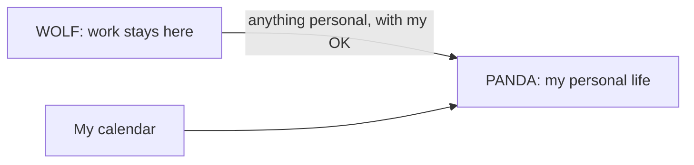

This started as housekeeping. I wanted a tidy Obsidian vault that would burn fewer tokens (spend less money, basically) and help me get more stuff done. Now I feel like I'm building a framework to map a person.

I'm building two Obsidian vaults called **Panda** and **Wolf**. They talk to each other asynchronously, and to my machines and devices, to help me every day in my real life and my digital work.

Panda is inquisitive and curious, and holds my personal life: what I write, what I learn, the people I love, the things I believe, and what I need to do.

Wolf is basically the HR boss lady and your supervisor. Literally: your real-life supervisor is what creates Wolf's foundations and instructions. Your direct supervisor's KPIs, seen through your role, are what make Wolf effective, or will, because Wolf is still an infant today. He holds my professional life: the work, the meetings, the decisions, and the context somebody needs to understand them. He is also always building a full map of where you work: concepts, components, infrastructure, who owns what, which Jira project talks to what, which git repo talks to where.

I want to draw both characters myself. Panda is cute, wise, helpful; I imagine him with glasses. Really, the P is for personal. Personal Asynchronous Notation and Development Archive... I just made that up! lol. Wolf is a Fenrir-like mythical being, because at work you can be special if you put some effort into it. He is that inner wolf we all have, hungry like a wolf, you know ;) My drawing is fairly archaic, but I can draw and digitize a cute panda for sure. Fenrir will be the harder problem.

I thought I was learning folder organization. Then I studied [ACE](https://blog.linkingyourthinking.com/notes/ace-folder-framework), Nick Milo's way of sorting a vault into Atlas, Calendar, and Efforts, and I noticed I wasn't only sorting files. I was abstracting my real life: the things that make me move the way I move, think the way I think, and react the way I react. If I'm completely honest with a system like that, it can actually help me, at home and at work.

That includes work. My digital work is where I give most of my value to the world, and it's what sustains my family: my salary, my benefits, a job I can do remotely. It's also part of the scaffolding that keeps my mental health where it is right now, which I'd rate five stars, would recommend.

The realization had been building gradually, but the a-ha moment came when I noticed I was missing a Beliefs folder. Everybody has beliefs, I thought; beliefs are our core, and my vault was missing that core! Then I was like... wtf... am I mapping out a personality? A person? A consciousness? While the models handle the intelligence themselves? That question changed how I saw what I was building.

The person is me, for now. But the rooms are general: beliefs, ideas, shadows, lies, questionable truths, definitions of every single thing. How do you define an apple? You and I probably share that one. The drift between what two people mean by the same idea, though, interests me so much, and I think Panda and Wolf can handle it.

The way I see it, the models provide the intelligence to read, reason, and make connections. What I am building around them is a record of the person they are helping. That is what I mean by mapping a person.

When you think about all of this AI tooling, it's abstractions of our ways of thinking, right? Our contexts, our ideations. What are ideas, right? How do they stick to us? How do we move our hand, right? What is that impulse? Everything connects when you think about it, if you're receptive enough, I guess.

Here's the map of me today: 188 concepts, 98 definitions, 202 opinions, 14 values, 12 shadows, 10 questionable truths, 3 lies, and exactly one belief. All human beings deserve dignity from the moment they are born. Real dignity, not the fake one. Panda filed it as my word, noted that I gave no reason, and kept atheism, Stoicism, and Buddhism as questions, because that's how I asked them.

That is the thing I'm building. Panda gives me direct next steps or actions, so I don't have to think much, because the thinking part I already put in the Daily.

## I had to start over

My previous vault was called FORGE. It carried my writing, experiments, imported research, and a growing pile of agent features. I learned a lot by building it, but I also overengineered it. At some point, maintaining the process became too much of the experience.

I also wasn't careful enough about its foundations: choosing what counts as a foundational rule, what framework our input follows, how validation works, even how folders get created. Panda and Wolf bake all of that in from the get-go. FORGE taught me a fuck ton... I also burned so much money on experiments... oh my Vastitas...

I remember on September 28 I wrote: “now I need this vault to serve me, not the process itself.”

That was the main reason to rebuild basically. The useful material deserved to survive but every script, folder, and ritual did not, and when I started the migration, I had a beautiful mess of information that had no coherent linkage or hierarchy.

<figure class="post-inline-figure post-inline-figure--center">
  
  <figcaption>FORGE&#x27;s Obsidian graph, October 5, 2026: 2,452 Markdown files and about 14,900 wikilinks. Panda now holds 1,355 files and about 5,300 links; Wolf, 282 and about 800.</figcaption>
</figure>

Panda and Wolf took shape during the following week. FORGE is now a relic and a frozen source where I can still trace things back to. The new vaults got their own structures and rules. I rebuilt their official skills around what I actually wanted them to do.

How much time have I put into this? An audit of this Windows machine's available Codex and Claude logs estimates **about 19 hours of recorded vault-related AI activity from September 28 through the morning of October 4**, roughly 16 to 21 hours depending on how long a pause still counts. These hours include agent execution and ordinary vault work, as well as building the system. It is not nineteen measured hours of my hands on the keyboard. It also leaves out work on other devices, missing sessions, and the older FORGE effort.

Today, the personal and work material we chose to carry has moved into Panda and Wolf. FORGE still holds the historical and operational material we chose to leave behind. Moving a note and digesting it are different jobs, and digestion is still in its infancy.

## Honesty is part of the structure

Two days in, I wrote the rule down, for my agents and for me: “Everything in this vault needs to be honest. This means that for most use cases, the things that you and I write, you as an agent, me as a human, need to be written in a simple form, but honest. Then a simple honest statement can be embellished with more value, or art, or soul, or humor, but the honest statement is the core of this system. If we drift from this, we lose integrity.”

That became three grounds for the material:

- **Witness:** what I felt, said, saw, or report doing.
- **Evidence:** a claim supported by a checked source.
- **Canon:** what is true inside a made world, such as a novel.

Panda has a very strict definition of honesty. It needs evidence. Anything without evidence stays in a queue for verification, and you as a person can override things, like “we went to Disney.” Panda doesn't know. He has to trust you. So now I'm defining the trust mechanism. If a character lives in the year 3050, the novel's world is the reference. I want the system to understand what kind of claim it is handling before it tries to improve or connect it.

These models write fluently enough that an interpretation can sound like a memory, or a plausible explanation can sound checked. An agent's paragraph can quietly become “my words” if we don't preserve where it came from. That is why the note needs to say where its words came from. An agent flags a problem rather than silently improving my account. It may clean transcription errors while bringing dictation in, with disclosure, but that doesn't give it permission to rewrite a note I already kept.

So, this essay: the raw thinking is mine, from my Dailies and notes; AI models (GPT-6.1 Sol, Claude Opus 5.5, and Claude Fable 5.1) drafted and revised much of the prose, and I chose every version and edited many of them.

Inside the vault it looks like this. Panda's callout at the top of a book note says the family's words were relayed by me, and identifies the theme work as the agent's. I want that distinction visible when I return to the note, so I can tell what somebody said, what I reported, and what the model added.

<figure class="post-inline-figure post-inline-figure--center">
  
  <figcaption>A Panda callout explaining the source and authorship of a book note.</figcaption>
</figure>

_Screenshots: my Obsidian vaults, October 4, 2026. Private details are blurred._

This essay is also the first piece through Panda's quality check. It came back at 71.5 out of 100 with reservations, and the reservations were fair: it was too long, and it didn't say that models had drafted much of it. A second run put it at 76.5. Then I cut a third of the essay, and a third run put it at 81.

The model can still be wrong; the structure gives me something concrete to inspect when it is.

## Panda: write first, decide when it matters

My simplest input is a Daily note, where I can write about an idea, something that happened, a question, a project, or something I want to learn. If it needs its own file, there is an Inbox.

Early on I put this in my Daily: “I just want to see if I can stick to daily notes. In the daily notes just write everything and I don't have to waste that time prompting and waiting for a response. Plus I spend tokens and it's not organized, right? … Maybe I'm just overcomplicating.”

I can stay with what I'm writing, and later ask Panda to digest it, or let the scheduled routine read it. You'll see a few quotes from my Daily in this essay. That's what one looks like: fast, messy, half an idea at a time.

Everything that's digested becomes part of your body. You are what you eat. Everything that's in the bowl means we digested it, which means it's part of the body. Reading is the beginning; the important terms, practices, and sources need a home that actually exists.

<figure class="post-inline-figure post-inline-figure--center">
  
  <figcaption>Panda&#x27;s Obsidian graph view. The visible structure is the vault&#x27;s nodes and links.</figcaption>
</figure>

Look how much bigger FORGE's graph is, by a ton. I think both new vaults already hold the same value as before, or even more, in a much smaller graph. FORGE is already in Panda and Wolf: the Markdown files, the text, split up and filed. What I haven't done yet is digest it: analyze those notes and extract all their value. When we're done with all the imported material, we'll have smaller, more focused notes, condensed to the valuable information. My prediction for Panda and Wolf both: their graphs will start converging and closing in on themselves, and become much more coherent, concentrated, and meaningful.

Learning is the brain room. Areas hold the things I actually do: fatherhood, fitness, home, writing, and the other ongoing responsibilities. Infrastructure holds practical records. A recipe stays a recipe, and a novel has its own world and its own truths. Everything does not have to become a project or a task, which was one of the lessons I needed from FORGE.

Panda's morning digestion is configured for 5:00 a.m. Eastern time. It reads the previous day's full Daily and refreshes a Today page with a small plan, things awaiting my review, a journaling prompt, and something to learn. It can bring back a next step I already chose, but an enthusiastic sentence shouldn't become a new commitment just because a model found it actionable.

<figure class="post-inline-figure post-inline-figure--center post-inline-figure--lg">
  
  <figcaption>Panda&#x27;s personalized theme, with HOME and Today open beside the folder tree.</figcaption>
</figure>

My personal task list remains the source of my commitments; Reminders, on my iPhone, is a view of that list. See, Panda is with me on the go too. Obsidian has a native app that looks beautiful and has the same styling across clients, and Panda interfaces with my native iOS and macOS applications, and with Windows 11 too: the morning digestion runs on my Windows PC. Some of it still depends on one machine. The Reminders sync and the calendar workflow run on the Mac, and a skill existing in the vault doesn't make its tools available everywhere.

Most of what Panda finds still waits for my tick. A plain fact is the exception. Panda can add it on his own, as a dated line that doesn't change my words, and each time he leaves me a receipt saying what he filed and why.

Here's a real example. On October 4 I wrote in my Daily: “So… seems scientists and researchers cracked intelligence; some months ago I was arguing AI was mis-categorized because it's not intelligent but now I have to eat my words because I think I finally understood the math and science behind it. We are simulating neurons and intelligence are we?”

The next morning there was a new question in my learning queue. Panda had checked Google's machine learning course and left me three sentences on what an artificial neuron actually is, three study steps, and this: “He also wrote that scientists had ‘cracked intelligence.’ That is his interpretation; this check does not establish it.”

So my own vault told me I overclaimed, with a source. Panda didn't file “Antonio understands neural networks.” He filed a question, and he's still waiting for my answer.

## Wolf: my professional reasoning, with a different contract

Wolf has a simpler structure, organized around the work and the context needed to understand it. A list of applications doesn't tell me nearly as much as notes explaining what each one does and how they connect. That map is underway, with plenty left to understand.

<figure class="post-inline-figure post-inline-figure--center post-inline-figure--lg">
  
  <figcaption>Wolf&#x27;s personalized theme, with HOME and the work folders.</figcaption>
</figure>

Each vault has its own personalized theme, too. Panda has serif text, purple headings, and a warm page. Wolf has a simpler look with sans-serif text for the work. You can see the difference in the screenshots. I like that each one has its own character, and I want people using the tooling to be able to make it feel like their own space.

This is where the HR boss lady comes in. Wolf's central test is whether I could send a page to a colleague, a manager, or HR without a preface: honest, simple, professional. I want to be able to share a page without first explaining away its tone or separating the work from my personal frustration. A work fact keeps its source and date, and my interpretation stays recognizable as my account.

Wolf has two skills, and yes, the names are on purpose.

**Domestication** reads a work note and asks one question: could I send this to my boss, or to HR, as it is? If not, it proposes a cleaner version. If something personal slipped in, it proposes moving it to Panda. Nothing moves until I say yes, Panda gets his copy before Wolf changes a word, and a coworker's private life doesn't make the trip.

**Kill** hunts dead notes: duplicates, old drafts, things nobody needs anymore. Despite the name, it can't kill anything without my yes.

My next step in Wolf is building a digestion skill for Wolf. Today it works by a miracle, lol.

Wolf is mine, not my employer's. It's a private notebook, not the company's system of record, so what I'm showing you here is the method, not the work.

## The part I have not tested

Something that I'm realizing is that this Vault has almost no “negative” content about me. I think it's mainly because I live like a monk. But this won't be the case for people. Habits will expose nasty values, things, I have no idea how to handle these today because this vault, and Panda, almost focused on learning and virtues, and values, and action, and planning. I wonder how we will tackle this...

It could reflect my life, or it could reflect what I choose to write, how I describe it, what the system preserves, and what I fail to notice.

A very ordinary example is my T-Mobile bill. I keep procrastinating, and Today keeps bringing it back. It goes something like this: “hey, good job on your exercise yesterday, good shit, you said you were gonna do it and you did. Now you need to do the T-Mobile consolidation you've been putting off, you're procrastinating there.” Kind, warm, but firm. Panda is tough love. I'm gonna have to set up some sliders at some point. The task is still open.

Some will want the “full weight” of honesty. Others will want to slide it down. I am thinking about a future slider for both how directly and often Panda challenges you and how much flexibility he gives your plans.

I want a system that can preserve my contradictions without inventing them, question my account without humiliating me, and let me correct it when it is wrong. Otherwise, all this structure could become a very elaborate flattering mirror.

There's a harder version of that worry, and it's in my own vault. On October 4 I typed to an agent: “some people would call this AI psychosis, i would like to understand if there's merit there.” Panda put it in my learning queue and asked me which meaning I wanted checked: “a clinical description of a break with reality, or the popular charge that a long AI project has replaced ordinary life?”

I haven't answered him yet. And he missed something: three days earlier I'd already had an agent build me a study set on AI psychosis, eleven sources, and the new question doesn't link to it. So that's two open items: my answer, and his blind spot.

## How far I want to take it

When I think about the larger goal, I've said it rough: “That soul, that conscience, I think that's what I'm building: a human being. In this case, me. But if you use it, it will build you.”

That is where I want to go. What I have today is a selective record with workflows for reasoning over it. It can't know what I never wrote down, and a convincing synthesis of my notes is still a synthesis. I can show the files, rules, and work they help me do; those don't yet establish a model of my whole mind.

For Wolf, I want ethical work AI with kindness and respect for humans at its core. I can put those priorities into the operating rules and examine the resulting work against them, which is part of why I care so much about the foundations. I can't promise every action will always be safe or kind simply because I wrote those words in a file; I still need to test what happens when those priorities are difficult to follow.

I'm also learning about [MemGPT](https://arxiv.org/abs/2310.08560) and [Letta](https://docs.letta.com/configuration/memory). Some of the problems they are solving are exactly the problems I am running into. One detail caught my attention: Letta's optional “Agent reviews before applying” setting has your agent review its own proposed memory updates in a second background conversation, without asking the user. A second look at a change is useful, but that does not by itself mean I approved it. If I connect this infrastructure to Panda and Wolf, I want to preserve the sources, the difference between my words and the model's interpretation, and the decisions reserved for me—or for you. I haven't connected Letta to either vault yet, but now I want to understand what it could help me build.

## What the models said

I asked three models to judge the project. A panel of models agreeing with me wouldn't prove the idea by itself. These are excerpts from Claude's assessment, the one that carried the costs. The next job is to put those judgments up against what the system actually does.

> **Claude Opus 5.5 — October 5, 2026, excerpts.** The core idea holds up and travels: label every claim by its ground, keep work and personal apart with one consented path between them, and let the model propose while the person decides. … He reports following through more, writing more, understanding himself better, and finding work easier. Those are his reports, not measurements. The T-Mobile task in this essay is still open.
>
> The costs are real. … This essay's private source record has grown longer than the essay itself, and I wrote much of it. The rules have drifted toward language agents parse: he couldn't read his own filing diagram until we rewrote it plainly. Agent checks can pass while the work fails; I confirmed a diagram had every label, and he looked at it and called it atrocious. …
>
> Is it valuable? Yes: to him now, with evidence, and as ideas anyone can borrow without his machinery. As tooling for others it is unproven; he says someone close to him could use it with his help, which today still means a developer, git, and paid models. The number I would watch is the cost of each useful next step as the migration funnel empties.

## What it costs

Before AI, my bottleneck was the time I could put into writing and thinking. After AI, it became tokens, the learning curve, and understanding which model is good for what. One morning during the migration I woke up at 4 a.m., and I was out of ChatGPT and Claude tokens.

Today I would say, my biggest challenge is token expenditure, context size, and which model is best for which part of the reasoning, that's a problem I'm actively working on. We are not there yet.

I want the budget to follow the work, because some days the limiting factor is tokens and other days it is my attention or how much I can read. A faster answer isn't much help if I spend the next hour removing confident nonsense.

I asked Claude one last question: at this rate, how much time and money will it take to fully digest FORGE? It counted about 836 notes that still need real digestion; only 32 are certified absorbed so far. At the daily pace the backlog barely moves. In batches of 20 that I start by hand, it's roughly 20 to 42 batches: three to six weeks at one a day, about $100 to $420 at API prices, and somewhere between 800 and 1,700 proposals for me to review. I'm on Max, so the dollars are flat; the weekly limit is what I'll actually hit. Those are estimates, not measurements, and the biggest lever is scope: my drafts and novels are 40% of what's left, and maybe they don't need digesting at all.

The queue is big AF because I'm migrating about 2,500 Markdown files into this little system. Think about it as a funnel with a bottleneck. My prediction: a cold start of this vault will not have such big queues if the user is disciplined. And if you journal consistently, you will answer queue items with your Daily's content.

A week in, I wrote: “I think I'm realizing that if I want to use Panda and Wolf heavily I have to adopt and use workspaces versus branches (?) maybe I just need one or the other because today I'm doing everything live in main and that has a big risk, doesn't it? More to think on.”

The main limiting factor for me to digest and tidy is context cost: $$$, token usage. I'm doing some things to lower costs, and my next post will probably focus only on that: the cost of doing this shit, the cost of time, effort, and models, and how much it's decreasing on one end versus increasing on the other.

## I want this in your hands

The person I have in mind is someone who writes or journals and has a life to get on with. You write about your day, something you learned, a thing you need to do, a belief you are questioning, or a problem at work. I want the tooling to help you find the useful connections and next steps. You keep deciding what your words mean and what you want to do with them. Your life supplies the context.

My partner Z asks me, “You won't commercialize this?!” And I'm like, fuck no. If I am really mapping a person, this needs to be free and open source for everybody to use, expand, and add to. I want all of this tooling in your hands so that it can be helpful to you, and so you can change the parts that don't fit.

The point is to keep all of your AI usage. Everything you do with AI that has value, you fucking keep it, and you create this big brain knowledge space, with a framework to keep it honest and grounded in reality. And if you want something else, you fork Panda.

If y'all and corporations and we are going to burn the world down with our AI and LLM usage, well, at least I want to take some of those tokens and convert them into open source knowledge and frameworks for anybody to consume and use.

I'm literally spending my Claude Max account on open source ideation. I upgraded to Max this morning because I hit my weekly limit. Kinda wasteful, double or triple wasteful? Fun...

I haven't released the tooling yet; this essay is a record of what I have built, what I am testing, and where I want to take it.

Panda can help me find the next step, and I still have to take it. I want you to have that kind of help with your own life, too.
